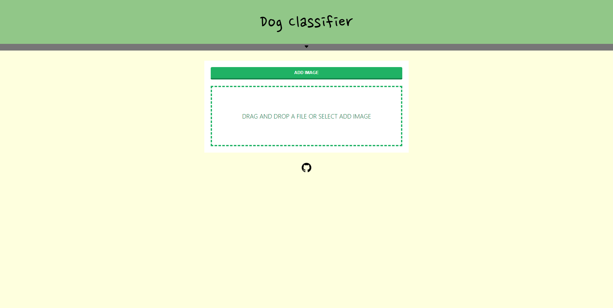
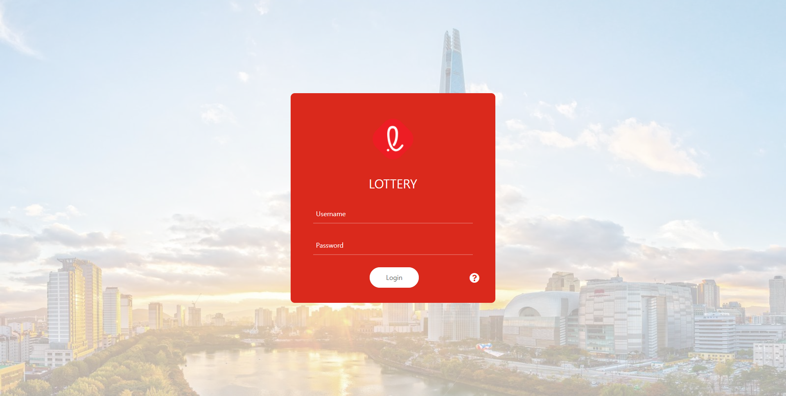

	

		

			
		

	

    

    

    <h5 style="margin-top: 0; margin-bottom: 0.5rem; font-family: 'Merriweather', 'Nanum Gothic', serif;" >복영규 (Younggyu Bok)</h5>
    <h6 style="mmargin: 0;">Master's student in UNIST (Department of Industrial Engineering)</h6>

##### Research interests

Big data, Optimization, Data mining

##### Education

`2016-2022, UNIST`
Bachelor of Science (Management Engineering)  
`2022-Now, UNIST`
Master's Student (Industrial Engineering)

##### Web Project

	<input type="radio" name="slide" id="slide01" checked>
	<input type="radio" name="slide" id="slide02">
	<ul class="slidelist">
		<li class="slideitem">
			<h6 class="textbox" style="font-family: 'Merriweather'; margin: 0.5rem 0 0 0;">Dog classifier</h6>
			
		</li>
		<li class="slideitem">
			<h6 class="textbox" style="font-family: 'Merriweather'; margin: 0.5rem 0 0 0;">Lottery</h6>
			
		</li>
	</ul>
	

		

			<label for="slide02" class="prev"></label>
			<label for="slide02" class="next"></label>
		

		

			<label for="slide01" class="prev"></label>
			<label for="slide01" class="next"></label>
		

	

