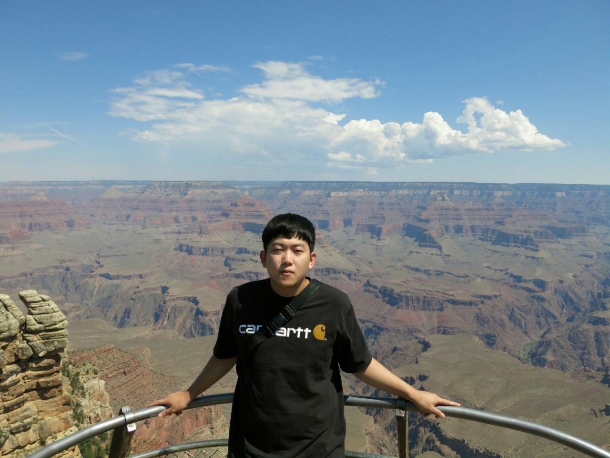

    

        

    

    

    <h5 style="margin-top: 0; margin-bottom: 0.5rem; font-family: 'Merriweather', 'Nanum Gothic', serif;" >복영규 (Younggyu Bok)</h5>
    <h6 style="mmargin: 0;">Master's student in UNIST (Department of Industrial Engineering)</h6>

##### Research interests

Big data, Optimization, Data mining

##### Education

`2016-2022, UNIST`
Bachelor of Science (Management Engineering)  
`2022-Now, UNIST`
Master's Student (Industrial Engineering)